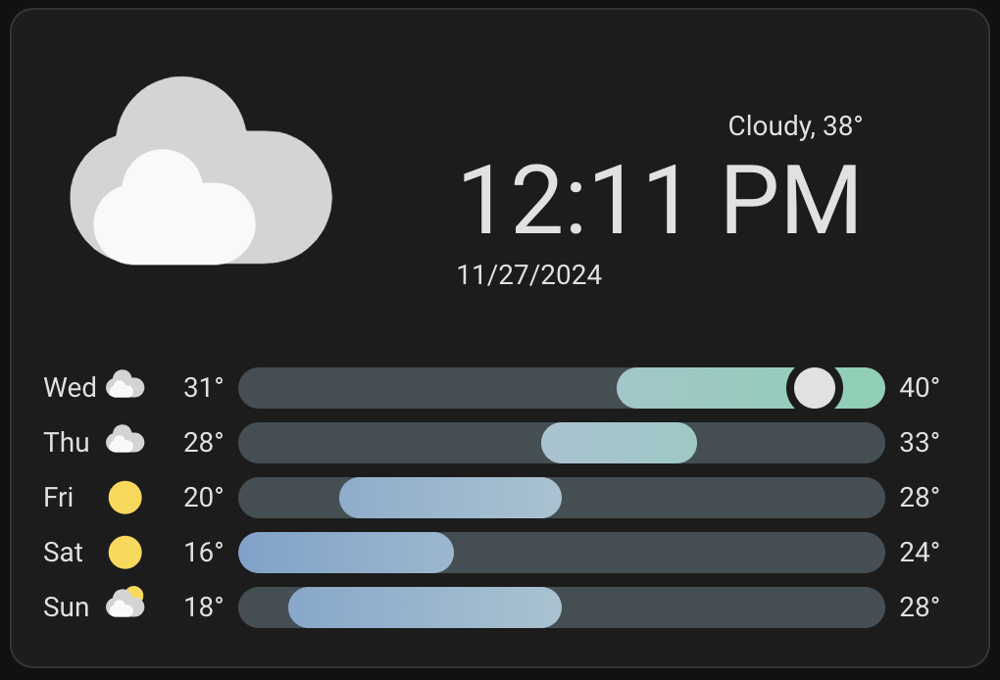
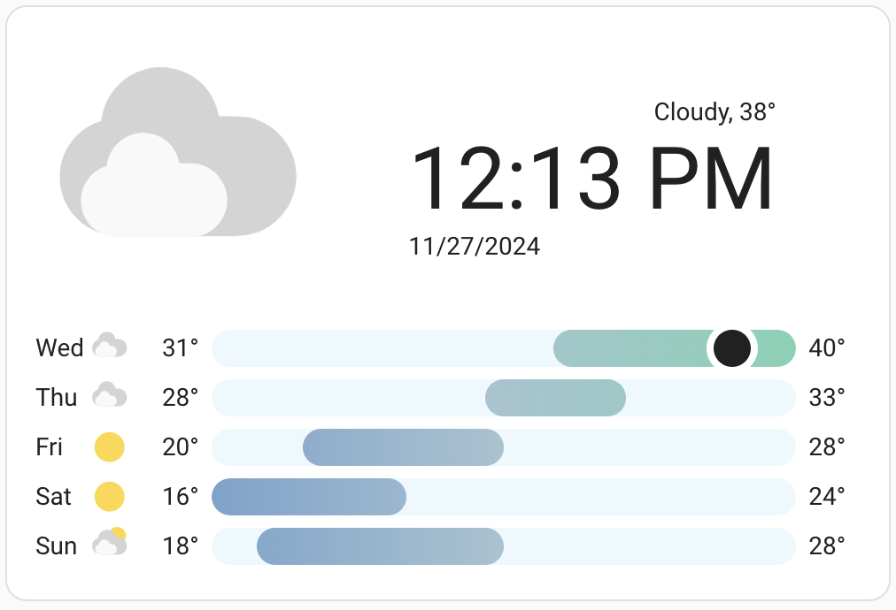

# Clock Weather Card HUI Icons

[](https://github.com/hacs/integration)
[](https://github.com/samuelgoodell/clock-weather-card-hui-icons/releases)
[](https://github.com/samuelgoodell/clock-weather-card-hui-icons/releases/latest)
[](https://github.com/samuelgoodell/clock-weather-card-hui-icons/releases/latest)

A [Home Assistant Dashboard Card](https://www.home-assistant.io/dashboards/) available through the [Home Assistant Community Store](https://hacs.xyz) showing the current date, time and a weather forecast, using icons consistent with other first-party HUI weather cards.




## Attribution

This is a fork of the [Clock Weather Card](https://github.com/pkissling/clock-weather-card) by [Patrick Kissling](https://github.com/pkissling).  I created this fork to customize the icons and have a consistent style in my personal Home Assistant dashboards.

## FAQ

* [Why don't I see the current day in my weather forecast?](#why-dont-i-see-the-current-day-in-my-weather-forecast)
* [What does the card actually display?](#what-does-the-card-actually-display)

### Why don't I see the current day in my weather forecast?

Your weather provider may not provide today's weather as part of their weather forecast. You may consider switching to a different weather provider.
[OpenWeatherMap](https://www.home-assistant.io/integrations/openweathermap/) is one of the weather integrations providing today's weather.

### What does the card actually display?

The bars represent the temperature range for a given day.
In the README screenshots, the 16° on Thursday represents the low across all of the forecast days and the 40° represents the highs (i.e. all bars are from 16° to 40°).
The colored portion of the bar represents the range of temperatures that are forecast for that day (so 20° to 28° on Friday).
The circle represents the current temperature (38°).

_Thanks to @deprecatedcoder for this text from [#143](https://github.com/pkissling/clock-weather-card/issues/143)_

The basic idea of the forecast bars is to be able to understand the weather trend for the upcoming days in a single glance.

## Installation

### Manual Installation

1. Download the [clock-weather-card-hui-icons](https://www.github.com/samuelgoodell/clock-weather-card-hui-icons/releases/latest/download/clock-weather-card-hui-icons.js).
2. Place the file in your Home Assistant's `config/www` folder.
3. Add the configuration to your `ui-lovelace.yaml`.

   ```yaml
   resources:
     - url: /local/clock-weather-card-hui-icons.js
       type: module
   ```

4. Add [configuration](#configuration) for the card in your `ui-lovelace.yaml`.

### Installation and tracking with `hacs`

1. Make sure the [HACS](https://github.com/custom-components/hacs) component is installed and working.
2. Search for `clock-weather-card-hui-icons` in HACS and install it.
3. Depening on whether you manage your Lovelace resources via YAML (3i) or UI (3ii), you have to add the corresponding resources.
   1. **YAML:** Add the configuration to your `ui-lovelace.yaml`.

      ```yaml
      resources:
        - url: /hacsfiles/clock-weather-card-hui-icons/clock-weather-card-hui-icons.js
          type: module
      ```

   2. **UI:** Add Lovelace resource [](https://my.home-assistant.io/redirect/lovelace_resources).
      _(Alternatively go to Settings -> Dashboards -> Resources -> Add Resource)_

      ```yaml
      URL: /hacsfiles/clock-weather-card-hui-icons/clock-weather-card-hui-icons.js
      Type: JavaScript Module
      ```

4. Restart Home Assistant.
5. Add [configuration](#configuration) for the card in your `ui-lovelace.yaml` or via the UI.

## Configuration

### Minimal configuration

```yaml
type: custom:clock-weather-card-hui-icons
entity: weather.home  # replace with your weather providers's entity id
```

### Full configuration

```yaml
type: custom:clock-weather-card-hui-icons
entity: weather.home  # replace with your weather providers's entity id
title: Home
sun_entity: sun.sun
temperature_sensor: sensor.outdoor_temp
humidity_sensor: sensor.outdoor_humidity
forecast_rows: 5
locale: en-GB
time_pattern: HH:mm
time_format: 24
date_pattern: ccc, d.MM.yy
hide_today_section: false
hide_forecast_section: false
show_humidity: false
hide_clock: false
hide_date: false
hourly_forecast: false
use_browser_time: false
time_zone: null
show_decimal: false
apparent_sensor: sensor.real_feel_temperature
aqi_sensor: sensor.air_quality_index
```

### Options

| Name                  | Type             | Requirement  | Description                                                                                                                                                                                                                       | Default   |
| --------------------- | ---------------- | ------------ | --------------------------------------------------------------------------------------------------------------------------------------------------------------------------------------------------------------------------------- | --------- |
| type                  | string           | **Required** | `custom:clock-weather-card-hui-icons`                                                                                                                                                                                                       |           |
| entity                | string           | **Required** | ID of the weather entity                                                                                                                                                                                                          |           |
| title                 | string           | **Optional** | Title of the card                                                                                                                                                                                                                 | `''`      |
| sun_entity            | boolean          | **Optional** | ID of the sun entity. Used to determine whether to show a day or night icon. If sun integration is not enabled, day icon will be shown                                                                                            | `sun.sun` |
| temperature_sensor    | string           | **Optional** | ID of the temperature sensor entity. Used to show the current temperature based on a sensor value instead of the weather forecast                                                                                                 | `''`      |
| humidity_sensor       | string           | **Optional** | ID of the humidity sensor entity. Used to show the current humidity based on a sensor value, if `show_humidity` is set to `true`                                                                                                  | `''`      |
| forecast_rows         | number           | **Optional** | The amount of weather forecast rows to show. Depending on `hourly_forecast` each row either corresponds to a day or an hour                                                                                                       | `5`       |
| locale                | string[^1]       | **Optional** | Language to use for language specific text and date/time formatting. If not provided, falls back to the locale set in HA or, if not set in HA, to `en-GB`                                                                         | `en-GB`   |
| time_format           | `24` \| `12`     | **Optional** | Format used to display the time. If not provided, falls back to the default time format of the configured `locale`.  This option is ignored if `time_pattern` is set.                                                             | `24`      |
| time_pattern          | string           | **Optional** | Pattern to use for time formatting. See [luxon](https://moment.github.io/luxon/#/formatting?id=table-of-tokens) for valid tokens. If not provided, falls back to time_format option.                                              | `null`    |
| date_pattern          | string           | **Optional** | Pattern to use for date formatting. If not provided, falls back to a localized default date formatting. See [luxon](https://moment.github.io/luxon/#/formatting?id=table-of-tokens) for valid tokens                              | `D`       |
| show_humidity         | boolean          | **Optional** | Shows the humidity in the today section. Reads the value from `humidity_sensor`, if provided, otherwise from the `humidity` attribute of the configured weather `entity`                                                           | `false`   |
| hide_today_section    | boolean          | **Optional** | Hides the cards today section (upper section), containing the large weather icon, clock and current date                                                                                                                          | `false`   |
| hide_forecast_section | boolean          | **Optional** | Hides the cards forecast section (lower section),containing the weather forecast                                                                                                                                                  | `false`   |
| hide_clock            | boolean          | **Optional** | Hides the clock from the today section and prominently displays the current temperature instead                                                                                                                                   | `false`   |
| hide_date             | boolean          | **Optional** | Hides the date from the today section                                                                                                                                                                                             | `false`   |
| hourly_forecast       | boolean          | **Optional** | Displays an hourly forecast instead of daily                                                                                                                                                                                      | `false`   |
| use_browser_time      | boolean          | **Optional** | Uses the time from your browser to indicate the current time. If not provided, uses the [time_zone](https://www.home-assistant.io/blog/2015/05/09/utc-time-zone-awareness/#setting-up-your-time-zone) configured in HA            | `false`   |
| time_zone             | string           | **Optional** | Uses the given [time zone](https://en.wikipedia.org/wiki/List_of_tz_database_time_zones) to indicate the current date and time. If not provided, uses the time zone configured in HA                                              | `null`    |
| show_decimal          | boolean          | **Optional** | Displays main temperature without rounding                                                                                                                                                                                        | `false`   |
| apparent_sensor       | string           | **Optional** | ID of the apparent temperature sensor entity. It is used to show the apparent temperature based on a sensor and will only show it if value is provided.                                                                           | `''`      |
| aqi_sensor       | string           | **Optional** | ID of the Air Quality Index sensor entity. It is used to show the AQI based on a sensor and will only show it if value is provided.                                                                           | `''`      |

## Footnotes

[^1]: Supported languages: `bg`, `ca`, `cs` `da`, `de`, `el`,`en`, `es`, `et`, `fi`, `fr`, `he`, `hu`, `id`, `is`, `it`, `ko`, `lb`, `lt`, `nb`, `nl`, `pl`, `pt`, `pt-BR`, `ro`, `ru`, `sk`, `sl`, `sr`, `sr-Latn`, `sv`, `th`, `tr`, `uk`, `ur`, `vi`, `zh-CN`, `zh-TW`
